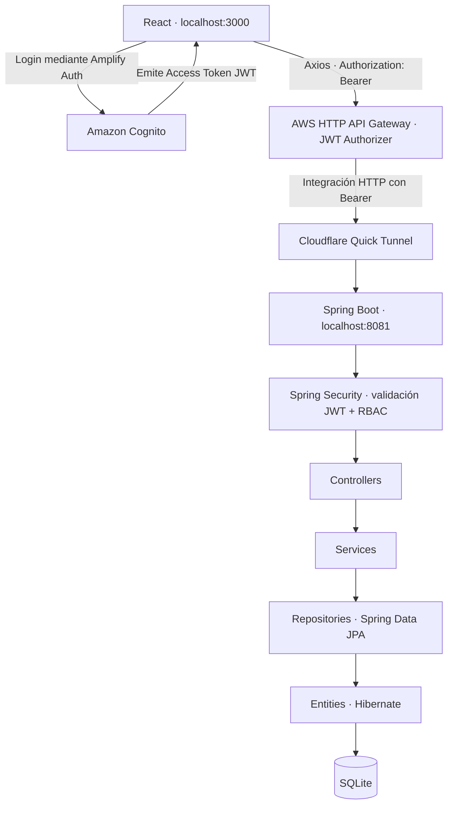

# PokePeluche

## Descripción

Aplicación FullStack para consultar y administrar un catálogo de peluches asociados a Pokémon y recibir mensajes de contacto. Proyecto académico de APIs seguras con diseño inspirado en Pokémon Emerald/GBA, tipografía VT323 y una interfaz responsive.

**Estado actual:** autenticación Cognito, autorización por roles en Spring, CRUD de productos y bandeja de mensajes implementados. La demostración mediante HTTP API Gateway y Cloudflare Quick Tunnel fue validada por el propietario. No hay carrito, pagos ni pedidos.

## Funcionalidades

- Login real con Amplify Auth y Cognito, cambio obligatorio de contraseña cuando corresponde, restauración de sesión y logout.
- Catálogo y detalle para usuarios autenticados, búsqueda sobre los productos cargados, precios en CLP y stock.
- Creación, edición y eliminación de productos exclusivamente para ADMIN.
- Formulario de contacto para USER, EDITOR y ADMIN.
- **Mensajes recibidos** en `/contacto/mensajes`, solo para EDITOR y ADMIN: fecha, nombre, email, asunto y mensaje, con carga, estado vacío, errores y reintento. La vista es de lectura; no permite editar, eliminar ni responder mensajes.
- Persistencia real en SQLite, DTOs validados y respuestas de error controladas.
- Imágenes locales o por URL HTTPS; imagen decorativa de contacto en `frontend/public/images/imagencontacto.png`. No hay subida de archivos desde la interfaz.

## Stack tecnológico

| Área | Tecnologías |
| --- | --- |
| Frontend | React 19, React Router 7, Axios 1, Vite 7, AWS Amplify 6, Lucide React, CSS propio y VT323 |
| Backend | Java 17, Spring Boot 3.5.11, Spring Web, Bean Validation, Spring Data JPA / Hibernate |
| Seguridad | Spring Security OAuth2 Resource Server, Nimbus JWT, Amazon Cognito, HTTP API Gateway JWT Authorizer |
| Persistencia | SQLite JDBC 3.45.1.0, Hibernate Community Dialects administrado por Spring Boot |
| Demostración | Frontend y backend locales, API Gateway en AWS, Cloudflare Quick Tunnel |
| Pruebas | JUnit, MockMvc, Spring Security Test, Mockito, Vitest, Testing Library, ESLint |

Requisitos: **JDK 17**, **Maven 3.9.x**, **Node.js >=22.12** y npm; `cloudflared` solo para la ruta completa por Gateway. Las versiones reproducibles del frontend están en `frontend/package-lock.json`: usar `npm ci`. SQLite no requiere un servidor ni una instalación separada.

## Arquitectura



Cognito autentica y emite tokens; después **React consume Gateway**, no Cognito, para obtener productos y mensajes. Para desarrollo también se puede usar React → Spring directamente, con la misma validación JWT y RBAC del backend.

El código y las reglas Spring se verifican en este repositorio. La configuración local revisada apunta a un endpoint HTTPS de API Gateway con base `/api`. Los recursos AWS y el Quick Tunnel son externos: su funcionamiento fue confirmado por el propietario, pero **no hay una exportación ni infraestructura como código versionada** para recrearlos automáticamente al clonar. La revisión documental no constituye una nueva auditoría de la consola AWS.

## Autenticación y autorización

**Autenticación** comprueba la identidad/token; **autorización** decide qué operaciones puede realizar esa identidad.

- Amplify configura un Cognito User Pool y un App Client de SPA **sin Client Secret**. El login usa SRP y formulario propio, sin Hosted UI ni OAuth2 login en Spring.
- El SDK administra la sesión y la renovación. `AuthProvider` restaura la sesión y responde a logout/fallos de renovación; `ProtectedRoute` controla navegación y roles.
- Axios obtiene el **Access Token** antes de cada petición protegida y agrega `Authorization: Bearer <Access Token>`. El ID Token se utiliza para datos de perfil, no para autorizar la API. `GET /api/public/info` no solicita token.
- Gateway verifica JWT en las rutas protegidas. El RBAC por grupos se aplica en **Spring**, no mediante la visibilidad de enlaces React.
- Spring usa discovery desde el issuer y claves JWK de Cognito con Nimbus. Comprueba firma **RS256**, issuer, `exp` obligatorio y vigente, `nbf` si existe, `token_use=access` y `client_id` del App Client. Conserva la tolerancia de reloj predeterminada de 60 segundos.
- `CognitoAuthoritiesConverter` transforma `cognito:groups` en authorities: `ADMIN` → `ROLE_ADMIN`, etc. Soporta varios grupos y claim ausente; un token sin grupos permitidos no obtiene acceso a las rutas protegidas.
- La API es **stateless**: sin sesión HTTP, form login ni HTTP Basic. CSRF está deshabilitado para esta API con Bearer explícito. Las rutas/métodos no declarados se deniegan.
- **401**: falta autenticación válida o token inválido/expirado. **403**: autenticación válida sin permiso suficiente. Los errores Spring usan JSON `application/problem+json`; Gateway puede rechazar una petición antes de llegar a Spring.

Cerrar sesión elimina el acceso desde la aplicación; la verificación local de JWT no consulta revocación por petición. Un token emitido puede seguir siendo aceptado hasta expirar. Los cambios de grupo requieren tokens actualizados.

## Matriz de permisos y rutas frontend

| Función / ruta | USER | EDITOR | ADMIN |
| --- | :---: | :---: | :---: |
| Catálogo `/productos` | Sí | Sí | Sí |
| Detalle `/productos/:id` | Sí | Sí | Sí |
| Enviar contacto `/contacto` | Sí | Sí | Sí |
| Leer mensajes `/contacto/mensajes` | No | Sí | Sí |
| CRUD `/admin/productos` | No | No | Sí |

`/login` permite iniciar sesión. Sin sesión, las rutas protegidas redirigen al login; con rol insuficiente muestran acceso restringido. USER no ve los accesos Mensajes/Gestionar y tampoco puede abrir sus URL directamente. La protección frontend no sustituye las reglas del backend.

## API REST

Rutas que recibe Spring; base local `http://localhost:8081/api`. Mediante Gateway se usa la URL de invocación y el prefijo configurado para las mismas operaciones.

| Método | Ruta | Autenticación / roles | Éxito |
| --- | --- | --- | --- |
| GET | `/api/public/info` | Público | 200 |
| GET | `/api/products` | JWT: USER, EDITOR, ADMIN | 200 |
| GET | `/api/products/{id}` | JWT: USER, EDITOR, ADMIN | 200 |
| POST | `/api/products` | JWT: ADMIN | 201 |
| PUT | `/api/products/{id}` | JWT: ADMIN | 200 |
| DELETE | `/api/products/{id}` | JWT: ADMIN | 204 |
| POST | `/api/contact` | JWT: USER, EDITOR, ADMIN | 201 |
| GET | `/api/contact` | JWT: EDITOR, ADMIN | 200 |

Productos se listan por `pokemonId`; contactos, por fecha e ID descendentes. Validación incorrecta devuelve 400; producto inexistente, 404; asociación Pokémon duplicada, 409. Los formularios conservan sus datos cuando falla el guardado.

### Datos y validación

- `Product`: `id` generado, `name` (120), `description` (2000), `price` entero entre 1 y 999999999, `stock` entre 0 y 999999, `imageUrl` (2048), `pokemonId` positivo y único, `pokemonName` (100, alfanumérico con guiones, normalizado a minúsculas).
- `imageUrl` admite `/images/archivo.svg|png|jpg|jpeg|webp` o URL HTTPS. El ID de producto es distinto del número Pokémon.
- `Contact`: `id` generado, `name` (100), `email` (254 y formato válido), `subject` (150), `message` (3000) y `createdAt` UTC generado en el servidor. Los textos son obligatorios. La interfaz muestra fecha/hora local.
- El backend rechaza propiedades desconocidas y decimales en campos enteros. `pokemonId` y nombre se ingresan manualmente: hoy se valida formato/unicidad, no su correspondencia mediante PokéAPI.
- Contacto guarda mensajes en SQLite; no envía correos.

## AWS y Cloudflare Tunnel

La demostración validada por el propietario utiliza:

| Recurso externo | Configuración de la demostración |
| --- | --- |
| Cognito User Pool | Usuarios reales y grupos `ADMIN`, `EDITOR`, `USER` |
| App Client | SPA sin Client Secret, compatible con el flujo SRP del frontend |
| HTTP API Gateway | Rutas e integraciones HTTP hacia el backend mediante el túnel |
| JWT Authorizer | Issuer del User Pool, audience igual al App Client, identidad desde Authorization; aplicado a rutas protegidas |
| Ruta pública | GET `/api/public/info` sin exigir JWT |
| CORS Gateway | Origen `http://localhost:3000`; Authorization y Content-Type permitidos; métodos de la API y preflight habilitados |

Para Access Tokens Cognito, Gateway puede comprobar `client_id` cuando no hay `aud`; Spring exige explícitamente `client_id` y `token_use=access`. Ver [JWT Authorizers de AWS](https://docs.aws.amazon.com/apigateway/latest/developerguide/http-api-jwt-authorizer.html). CORS no concede roles ni sustituye la autenticación. Spring conserva su CORS local para GET/POST/PUT/DELETE/OPTIONS y Authorization/Content-Type.

**Cloudflare Quick Tunnel es un puente temporal**, no hosting de producción: permite que Gateway alcance Spring en `127.0.0.1:8081`. Su dirección HTTPS `trycloudflare.com` puede cambiar al reiniciarlo; entonces hay que actualizar la integración HTTP de Gateway. Backend y túnel deben permanecer ejecutándose. La URL del túnel también expone el origen; Spring sigue validando JWT y RBAC incluso si una llamada no pasa por Gateway. Ver [Quick Tunnels de Cloudflare](https://developers.cloudflare.com/cloudflare-one/networks/connectors/cloudflare-tunnel/do-more-with-tunnels/trycloudflare/).

## Estructura del proyecto

```text
backend/
  pom.xml
  src/main/java/cl/pokepeluche/
    config/       # Resource Server, validadores, grupos, CORS y seed
    controller/   # API pública, productos y contacto
    service/      # Lógica de negocio y transacciones
    repository/   # Spring Data JPA
    entity/       # Product y Contact
    dto/          # Entrada/salida y Bean Validation
    exception/    # Errores HTTP
  src/main/resources/  # application.properties y schema.sql
  src/test/       # Negocio, JWT y seguridad HTTP
frontend/
  public/images/  # Imágenes de productos, contacto e ilustraciones
  src/api/        # Axios y servicios de productos/contacto
  src/auth/       # Amplify, contexto, sesión y ProtectedRoute
  src/pages/      # Catálogo, detalle, login, gestión, contacto y mensajes
  src/components/, hooks/, lib/, test/
  .env.example
lambda/           # Documentación de una mejora futura; sin implementación
docs/             # Requisitos, diseño, capturas y registros de fases
```

Los documentos de fases conservan antecedentes históricos; sus menciones a Gateway pendiente o a una bandeja inexistente no representan el estado actual descrito aquí. [Diseño y capturas](docs/diseno.md) · [Validación JWT en Spring](docs/fase-3-resource-server.md).

## Configuración e instalación

### 1. Clonar y preparar variables

```sh
git clone https://github.com/JuanBeltranV/tienda-pokepeluche.git
cd tienda-pokepeluche
```

Copia `frontend/.env.example` a `frontend/.env` (PowerShell: `Copy-Item frontend/.env.example frontend/.env`). Sustituye los placeholders siguientes por los identificadores públicos de tu entorno:

```dotenv
VITE_API_BASE_URL=http://localhost:8081/api
VITE_COGNITO_USER_POOL_ID=<USER_POOL_ID>
VITE_COGNITO_CLIENT_ID=<APP_CLIENT_ID>
```

La plantilla del repositorio contiene los identificadores públicos del proyecto y la URL **directa local**. Para la demo por Gateway cambia solo `VITE_API_BASE_URL` por su URL de invocación más el prefijo de rutas, por ejemplo `https://<API_ID>.execute-api.<REGION>.amazonaws.com/api` para una etapa por defecto. Si tu etapa tiene nombre, incluye ese segmento antes de `/api`. El cliente agrega `/products` o `/contact`: evita duplicar `/api`. Reinicia Vite tras editar `.env`; en producción estas variables se incorporan al ejecutar build.

Spring permite sobrescribir los valores públicos predeterminados de `application.properties` mediante variables del proceso. En PowerShell, antes de iniciar el backend:

```powershell
$env:COGNITO_ISSUER_URI = 'https://cognito-idp.<REGION>.amazonaws.com/<USER_POOL_ID>'
$env:COGNITO_CLIENT_ID = '<APP_CLIENT_ID>'
```

Usa el mismo User Pool/App Client en React, Gateway y Spring. El backend no carga automáticamente un `.env`. Necesita Internet al iniciar para discovery de Cognito; el login también requiere Cognito disponible. Clonar no crea usuarios ni recursos AWS: utiliza los existentes con autorización o configura tu propio entorno.

Las variables `VITE_*` son públicas. No guardar contraseñas, JWT, Client Secret ni claves AWS en ellas. `.env`, `node_modules`, `target`, `dist`, logs y SQLite local están excluidos de Git; `.env.example` sí está versionado.

### 2. Instalar y comprobar

Desde `frontend/`:

```sh
npm ci
npm run lint
npm test
npm run build
```

Desde `backend/`:

```sh
mvn clean verify
```

La descarga inicial de dependencias necesita npm/Maven Central. Detén el proceso del JAR antes de recompilarlo: Windows puede bloquear su reemplazo.

### 3. Iniciar backend y frontend

Terminal 1, desde `backend/`:

```sh
java -jar target/pokepeluche-0.1.0.jar
```

Alternativa: `mvn spring-boot:run`. Si Java en Windows informa `Unable to establish loopback connection`, usa `java "-Djdk.net.unixdomain.tmpdir=." -jar target/pokepeluche-0.1.0.jar`, alternativa comprobada en este proyecto.

Terminal 2, desde `frontend/`:

```sh
npm run dev
```

Abre [PokePeluche](http://localhost:3000) y [la información pública local](http://localhost:8081/api/public/info). Los puertos 3000 y 8081 deben estar disponibles. Vite usa `strictPort`; no elige otro puerto automáticamente.

### 4. Usar la ruta completa por Gateway

Con `cloudflared` instalado y Spring ejecutándose, abre otra terminal:

```sh
cloudflared tunnel --url http://127.0.0.1:8081
```

Usa la URL HTTPS que devuelve el túnel como destino de las integraciones HTTP de Gateway. Conserva los métodos y paths: por ejemplo, una llamada autenticada a `/api/products` debe llegar a Spring como `/api/products`. Si se utiliza una etapa con nombre, revisa su mapeo para que Spring no reciba un prefijo extra.

Mantén el Bearer hasta Spring, el JWT Authorizer en las rutas protegidas y el preflight CORS sin exigir token. Configura la base Gateway en `.env` y reinicia Vite. Al cambiar la URL del túnel, actualiza el destino Gateway, no la URL pública del frontend. La configuración AWS existente se administra fuera del repositorio; estos pasos no la aprovisionan automáticamente.

### SQLite y seed

Ejecuta siempre desde `backend/`: la ruta `productos_db.db` es relativa al directorio de trabajo. Hibernate genera tablas con `ddl-auto=update`; `schema.sql` aplica un índice único sobre `pokemon_id` después de JPA.

Si la tabla de productos está vacía y el seed está activo, se crean Bulbasaur #1, Charmander #4, Squirtle #7 y Pikachu #25. No se sobrescriben productos existentes ni se reponen borrados mientras quede alguno. Desactívalo con `SEED_DEMO=false` o `--app.seed-demo=false` al iniciar el JAR. Una base nueva no contiene contactos; los mensajes y cambios locales no viajan al clonar.

## Testing

| Suite | Cobertura existente |
| --- | --- |
| `ApiIntegrationTest` | CRUD, validaciones, duplicados, índice SQLite, contacto, seed y CORS; filtros activos y autenticación simulada |
| `SecurityIntegrationTest` | Matriz de roles, 401/403, grupos ausentes/múltiples, rutas denegadas, CORS y ausencia de sesión |
| `CognitoJwtTest` | Firma con claves efímeras, issuer, exp/nbf, token_use, client_id y conversión de grupos |
| `flows.test.jsx` | Catálogo, detalle, formularios, errores, contacto y login |
| `auth.test.jsx` | Sesión, login, cambio de contraseña, roles, navegación, mensajes, logout y fallos de renovación |
| `api-auth.test.js` | Bearer Access Token, lectura de contacto, API pública y protección frente a envío a otro origen |

Últimas ejecuciones registradas en el desarrollo: **34 tests backend y 40 frontend aprobados**, lint y build frontend correctos. Esta actualización documental no vuelve a ejecutar esas pruebas. Backend usa SQLite temporal separado; los tests evitan depender de Cognito/AWS y los del frontend simulan SDK/HTTP. No sustituyen la validación real de Gateway, CORS, túnel y cuentas Cognito, confirmada manualmente por el propietario.

## Flujo de una petición protegida y demostración

1. El usuario inicia sesión en React mediante Amplify y Cognito emite tokens.
2. Axios obtiene el Access Token y lo envía como Bearer a Gateway.
3. El JWT Authorizer valida el token antes de invocar la integración HTTP.
4. Quick Tunnel transporta la petición a Spring local.
5. Spring valida firma/claims, convierte grupos a `ROLE_*` y aplica la autorización por método/ruta.
6. Controller valida el DTO; Service ejecuta negocio; Repository/JPA/Hibernate consulta o modifica SQLite y devuelve la respuesta.

Para la demo, mantén activos frontend, backend y túnel. Comprueba en Network que la API apunta al dominio Gateway:

- Público sin token: `/api/public/info` → 200; productos/contacto sin token → 401.
- USER: catálogo y envío de contacto; GET contacto y operaciones de administración → 403, sin enlaces Mensajes/Gestionar.
- EDITOR: catálogo, envío y lectura de mensajes; operaciones de administración → 403.
- ADMIN: lectura de mensajes y CRUD de un producto de prueba: creación 201, edición 200 y eliminación 204.
- Recarga con F5 y cierra sesión entre cuentas. Captura estados HTTP y pantallas; oculta completamente JWT y datos personales de los mensajes.

## Estado actual y mejoras futuras

Cognito, Resource Server, RBAC, Gateway con JWT Authorizer, conexión de demostración por Quick Tunnel y mensajes recibidos forman parte del estado actual. El frontend y el backend siguen ejecutándose localmente; no se presenta esta demo como despliegue permanente.

**Mejoras opcionales futuras**, no requisitos faltantes de esta entrega:

- Lambda y PokéAPI para validar/normalizar asociaciones y completar la sección Pokédex; hoy `lambda/` solo contiene documentación y no hay consultas implementadas.
- Despliegue permanente del backend y sustitución de Quick Tunnel por conectividad estable.
- Infraestructura como código para reproducir los recursos externos.
